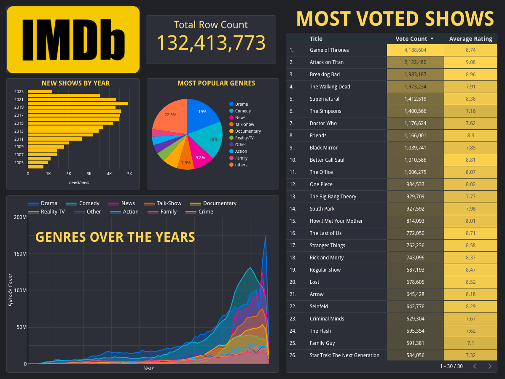

# DataTalks Capstone Project


## :movie_camera: Internet Movie Database (IMDB)

IMDB is an online database of information related to films, TV series, podcasts, home videos, video games, production crew, etc. \

Over the years, television has changed dramatically, but it remained true to its original utility, delivering images to a screen. The first "television" system broadcast was a straight-line by Philo Farnsworth on September 7th, 1927. Fast forward nearly a century, new television shows are being created at a fast rate at nearly 4,000 new shows per year!

## :grey_question: Questions We're All Asking
1. How do I even get this data?
2. How much has television grown over the years?
3. What are the top voted TV shows?
4. How does time effect a genre? What do we want!?

## :diamond_shape_with_a_dot_inside: Data Breakdown


How do I even get this data? Well our starting point is at this [URL](https://datasets.imdbws.com/) that gives us access to multiple IMDB datasets (make sure to read the [docs](https://www.imdb.com/interfaces/)!) All the datasets are gzipped .tsv format. To analyze and eventually visualize this data, we'll need to setup a data pipeline. \

The pipeline starts at the source, the raw data. That raw data will be converted into a format (parquet) that will eventually save us time and space. We'll move these newly converted files into a Google Cloud Storage, where we can load those files into the BigQuery database (our playground!). From BigQuery, we'll transform the data the way we need to in order to answer the above questions. Then we'll visualize that data using Google Looker Studio. \

The IMDB datasets are refreshed daily. The pipeline should be ran weekly.

## :station: Data Pipeline


## :sparkles: Technologies Used
- Cloud: `Google Cloud Storage`
- Infrastructure as code (IaC): `Terraform`
- Workflow Orchestration: `Prefect`
- Data Warehouse: `BigQuery`
- Transformation: `DBT`
- Batch Processing: `Spark`
- Data Visualization: `Looker Studio`

## :bar_chart: Dashboard
[Google Looker Link](https://lookerstudio.google.com/reporting/057d04ba-879a-4b4a-9f5c-d9e7a1537464)


## :notes: Join the Club!
1. Fork and Clone the repository
   
2. Steps to reproduce the project onto your machine (assuming you have a [Google Cloud account](https://cloud.google.com/free)): \
    a. Create a new [GCP project](https://console.cloud.google.com/cloud-resource-manager)
    b. Setup [service account & authentication](https://cloud.google.com/docs/authentication/getting-started) for this project
       * Download service-account-keys (.json) for auth.
    c. Download [SDK](https://cloud.google.com/sdk/docs/quickstart) for local setup
    d. Set environment variable to point to your downloaded GCP keys:
      ```shell
      export GOOGLE_APPLICATION_CREDENTIALS="<path/to/your/service-account-authkeys>.json"
      
      # Refresh token/session, and verify authentication
      gcloud auth application-default login
      ```

3. Setup for Access: \
    a. [IAM Roles](https://cloud.google.com/storage/docs/access-control/iam-roles) for Service account:
    * Go to the *IAM* section of *IAM & Admin* https://console.cloud.google.com/iam-admin/iam
    * Click the *Edit principal* icon for your service account.
    * Add these roles : **Storage Admin** + **BigQuery Admin**
    
    b. Enable these APIs for your project:
    * https://console.cloud.google.com/apis/library/iam.googleapis.com
    * https://console.cloud.google.com/apis/library/iamcredentials.googleapis.com
    
    c. Please ensure `GOOGLE_APPLICATION_CREDENTIALS` env-var is set.
    ```shell
    export GOOGLE_APPLICATION_CREDENTIALS="<path/to/your/service-account-authkeys>.json"
    ```

4. Setup Terraform \
    a. On OS, run the following commands:
    ```
    brew tap hashicorp/tap
    brew install hashicorp/tap/terraform
    ```
    b. Remaining instructions for Terraform [here](https://github.com/Trizzlenova/datatalks-imdb-capstone/tree/main/terraform) in the terraform directory

6. Setup Prefect \
    a. Sign-up for [Prefect](https://app.prefect.cloud/auth/login) start a workspace
    b. Create the following [prefect blocks](https://docs.prefect.io/latest/concepts/blocks/)
        - [GCP Credentials](https://prefecthq.github.io/prefect-gcp/)
        - [GCS Bucket](https://prefecthq.github.io/prefect-gcp/cloud_storage/#prefect_gcp.cloud_storage.GcsBucket)
    c. Configure your credentials with GCP

7. Run the pipeline :boom: \
    a. After the repository has been forked and cloned, cd into the repository
    b. Run the python environment: `pipenv shell`
    c. Install the dependencies: `pipenv install`
    d. Start your prefect environment: `prefect orion start`
    e. Open another terminal and start another python env: `pipenv shell`
    f. Run the flow using flask: `python3 manage.py` or `flask run`

## :alien: Next Steps
- Unit testing
- Update Pandas flow to Spark
- Setup Prefect-Fugue
- Showcase crew data to show most TV appearances from performer on dashboard
- Spatial map to visualize growth of shows per region
- Integrate [OMDB API](https://www.omdbapi.com/) for box office and rotten tomatoes data